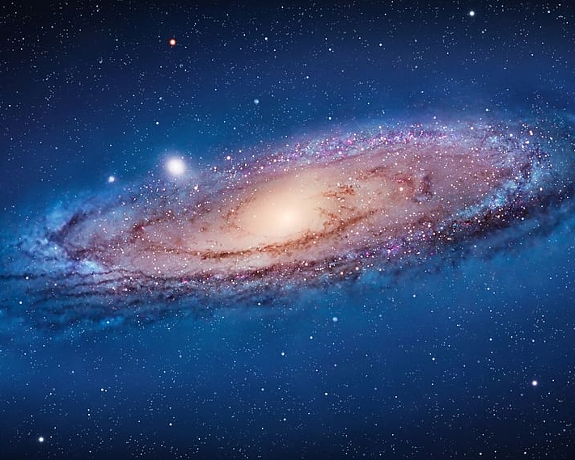
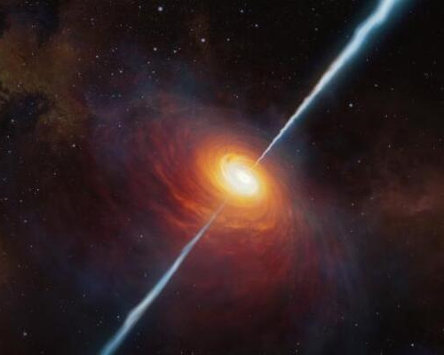
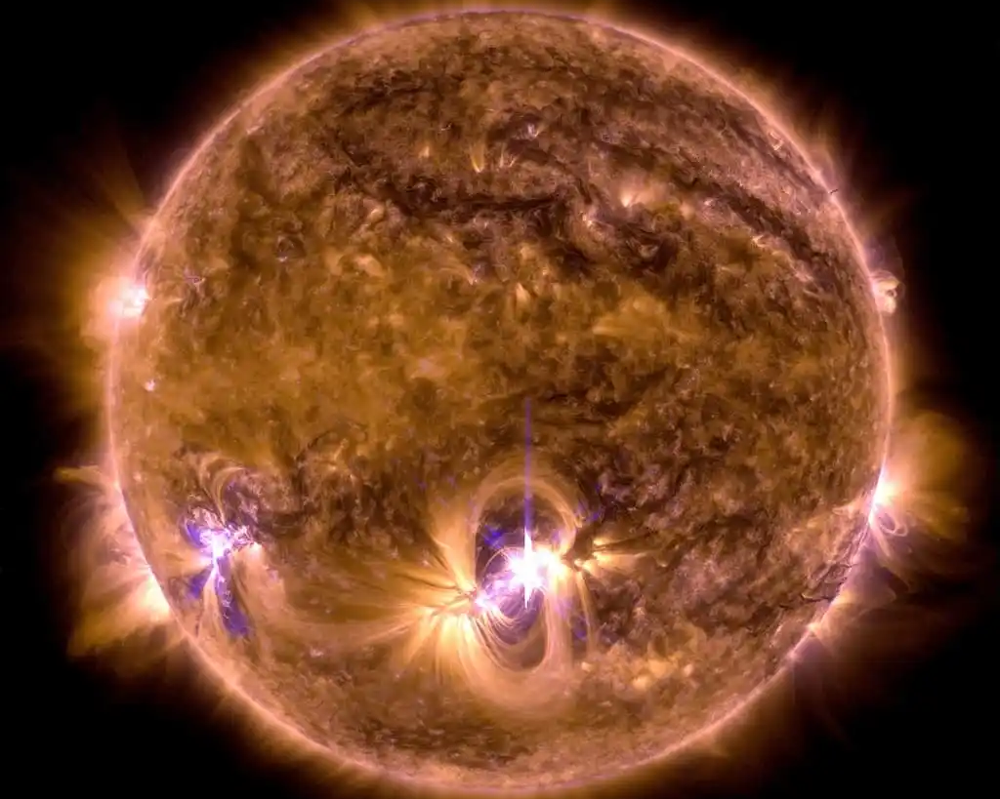
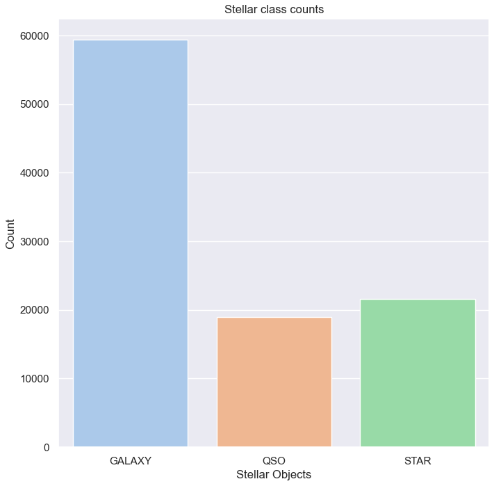
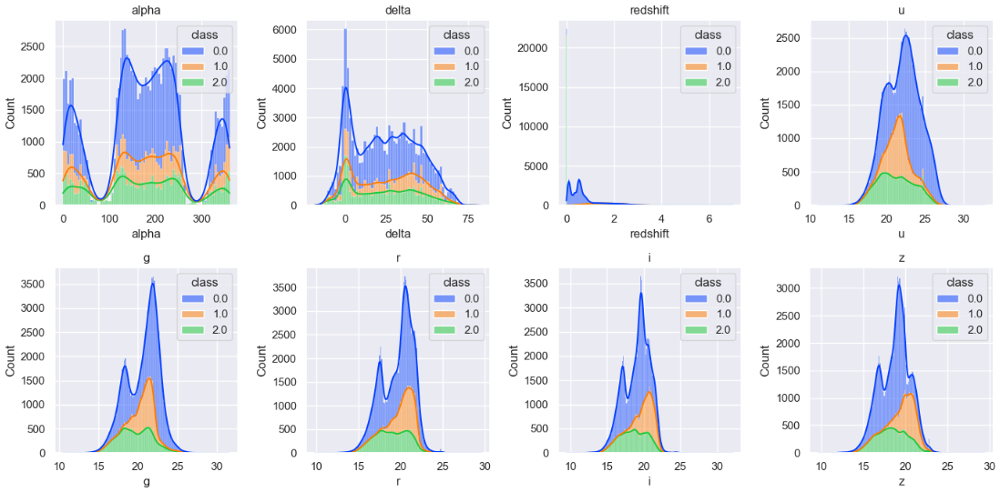

# AI Stellar Classification    

 </
 </
 

#### <pre>  Galaxy              Quasar               Star </pre>

###  The Goal of This Project
Using the stellar object dataset, can we evaluate the performance of multiple AI models (such as Neural Networks, Logisitic Regression, K Neighbours Classification, Gaussian NB, Decision Tree and Random Forest) in predicting the class of stellar objects (Galaxies, Quasars, Stars)? How do these models compare in terms of accuracy? Additionally, can we identify which features (e.g., redshift, alpha, delta, z) are most influential in determining the class of stellar objects?
 
### Information about the dataset
This dataset is made up of 100,000 observations of space taken by the SDSS (Sloan Digital Sky Survey). The dataset is split into 18 columns 17 feature columns and 1 class solumn which identifies the type of stellar object either galaxy, quasar or star.
 
|Column|Meaning|
|:-----|:-----|
|obj_ID| Object Identifier, the unique value that identifies the object in the image catalog used by the CAS|
|alpha| Right Ascension angle (at J2000 epoch)|
|delta| Declination angle (at J2000 epoch)|
|u| Ultraviolet filter in the photometric system|
|g| Green filter in the photometric system|
|r| Red filter in the photometric system|
|i| Near Infrared filter in the photometric system|
|z| Infrared filter in the photometric system|
|run_ID| Run Number used to identify specific scan|
|rerun_ID| Rerun Number to specify how the image was processed|
|cam_col| Camera column to identify the scanline within the run|
|field_ID| Field number to identify each field|
|spec_obj_ID| Unique ID used for optical spectroscopic objects (this means that 2 different observations with the same spec_obj_ID must share the output class)|
|class| object class (galaxy, star or quasar object)|
|redshift| redshift value based on the increase in wavelength|
|plate| plate ID, identifies each plate in SDSS|
|MJD| Modified Julian Date, used to indicate when a given piece of SDSS data was taken|
|fiber_ID| fiber ID that identifies the fiber that pointed the light at the focal plane in each observation|

*fedesoriano. (January 2022). Stellar Classification Dataset - SDSS17. Retrieved [15 October 2024] from https://www.kaggle.com/fedesoriano/stellar-classification-dataset-sdss17.*
 
### Installation
Download the files and place them all in a folder together then use your choice of Integrated Development Environment (IDE) to open and run the code.

### Prerequisites
- Python 3.12.4
- Pandas 2.2.2
- Numpy 1.26.4
- Matplotlib 3.8.4
- Seaborn 0.13.2
- scikit-learn 1.4.2

### Images

##### Data Split

##### Data Frequency

### Model Performance

|Model|Before|After (RFECV)|After (SelectKBest)|Features Selected (RFECV)|Features Selected (SelectKBest)|
|:-----|:-----|:-----|:-----|:-----|:-----|
|Neural Network (MLP)|96.43%|----|96.41%|----|8|
|Logistic Regression|95.79%|95.76%|95.59%|15|8|
|KNeighborsClassifier|90.45%|----|94.52%|----|8|
|GaussianNB|88.33%|----|87.20%|----|8|
|Decision Tree Classifier|97.56%|97.53%|97.30%|6|8|
|RandomForestClassifier|97.74%|97.88%|97.65%|9|8|
  

### Conclusion

Using the stellar object dataset, I evaluated the performance of Neural Networks, Logisitic Regression, K Neighbours Classification, Gaussian NB, Decision Tree and Random Forest models at predicting the class of stellar objects. The ending results demonstrated that the most ideal model for this task was a Random Forest Classifer with RFECV features selected achieving 97.88% accuracy. Additionally the best features for determining the class of the stellar objects was found to be u, i, z, spec_obj_ID and redshift.
